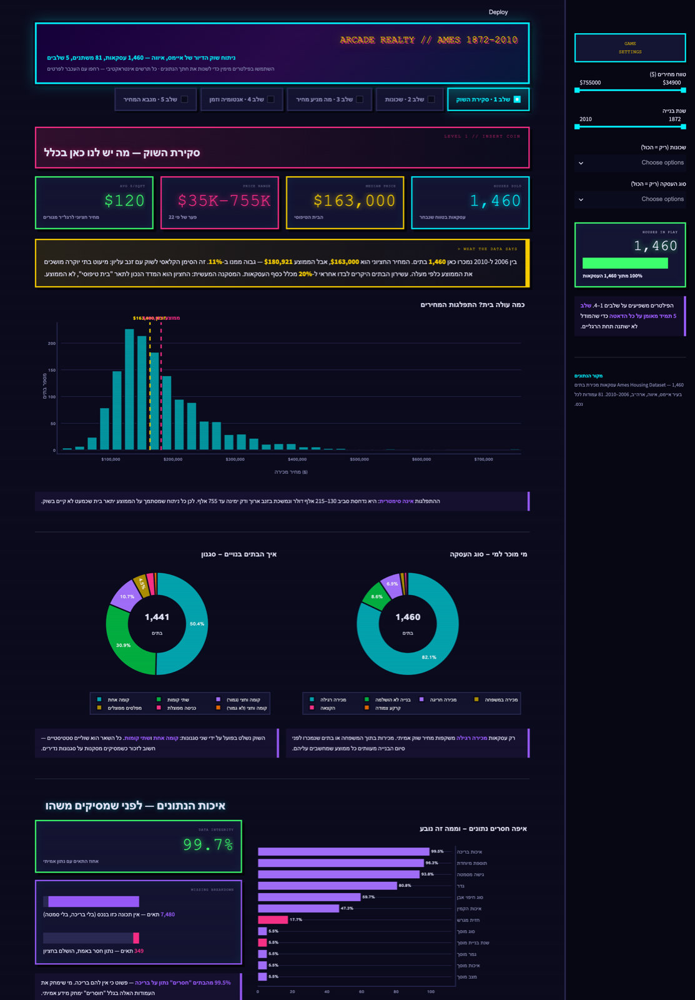
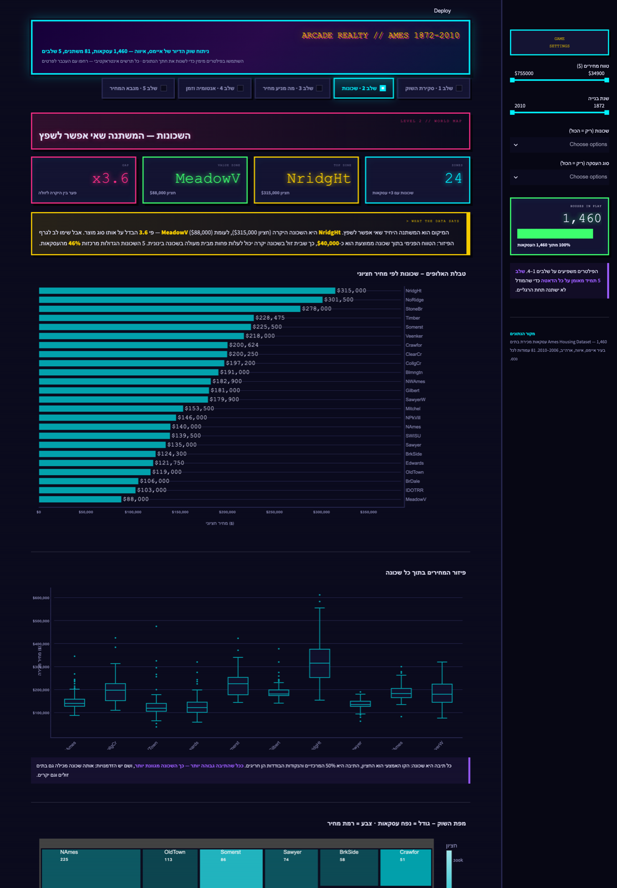
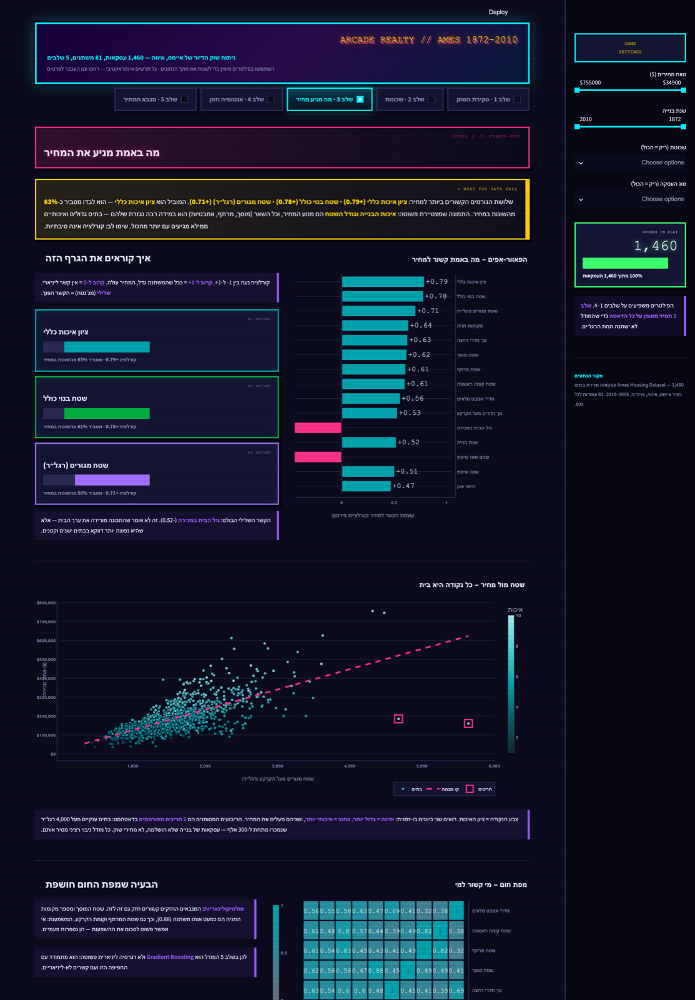
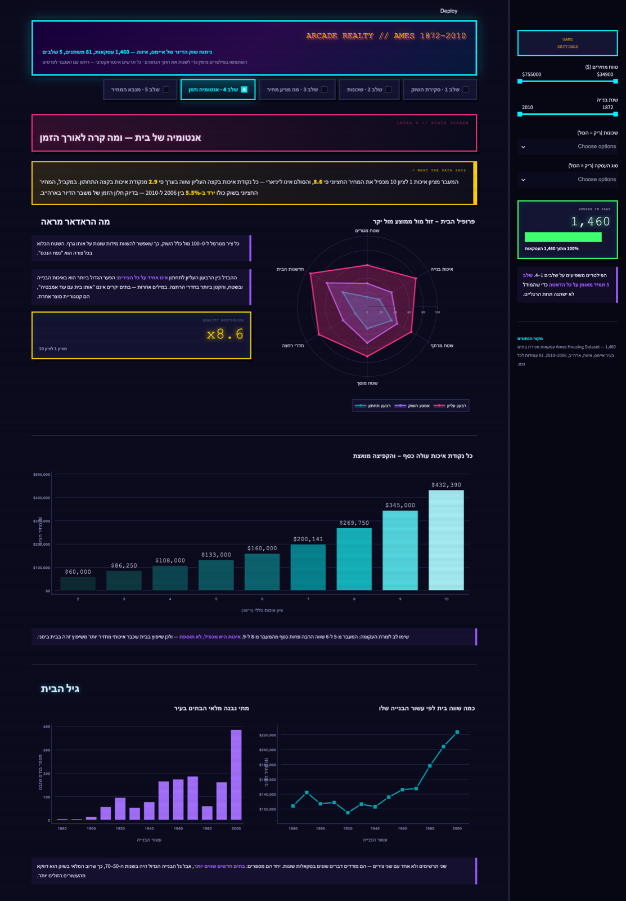
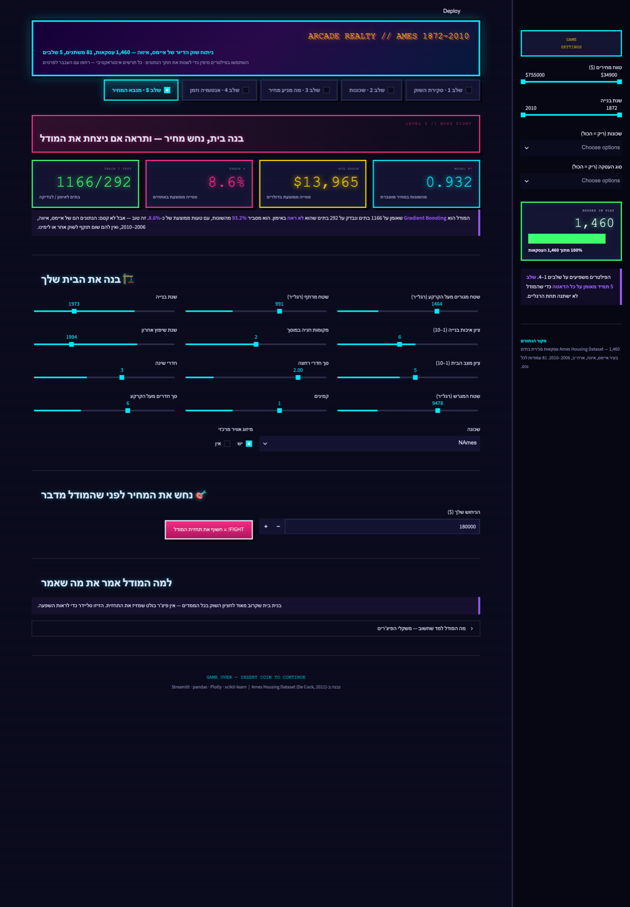

# 🕹 ARCADE REALTY — ניתוח שוק הדיור של איימס

דאשבורד Streamlit שמנתח 1,460 עסקאות מכירת בתים בעיר איימס, איווה (2006–2010),
ומסביר בעברית מה הנתונים באמת אומרים — בעיצוב של משחק ארקייד משנות ה-90.

**[🎮 לאפליקציה החיה](https://ames-arcade-dashboard-wxzzkfjnc3qltgizjxpz5z.streamlit.app/)**

---

## מה יש כאן

חמישה "שלבים", כל אחד עונה על שאלה אחרת. כל שלב נפתח בכרטיס תובנה
שמנוסח בעברית ומחושב **חי מהנתונים** — לא טקסט קבוע.

### שלב 1 · סקירת השוק
התפלגות המחירים, פילוח סוגי העסקאות והסגנונות, ומד איכות נתונים שמבדיל בין
"אין בנכס בריכה" לבין "נתון חסר באמת".



### שלב 2 · שכונות
דירוג 25 השכונות לפי מחיר חציוני, פיזור המחירים בתוך כל שכונה, ומפת נפח עסקאות.



### שלב 3 · מה מניע את המחיר
קורלציות, שטח מול מחיר עם סימון החריגים הידועים, מפת חום ומדידת
"כמה שווה כל תכונה" — כולל אזהרה מפורשת על מולטיקולינאריות וקורלציה מול סיבתיות.



### שלב 4 · אנטומיה של בית ומגמות זמן
ראדאר שמשווה פרופיל בית זול/ממוצע/יקר, מכפיל האיכות, גיל הבית ועונתיות.



### שלב 5 · מנבא המחיר
בונים בית עם סליידרים, מנחשים את המחיר, ומתמודדים מול מודל Gradient Boosting
שמדווח R² ו-MAE על סט בדיקה שלא ראה באימון. כולל פירוק של מה הזיז את התחזית.



---

## כמה מסקנות מהנתונים

| ממצא | מספר |
|---|---|
| מחיר חציוני מול ממוצע | 163,000$ מול 180,921$ — פער של 11% שמעיד על זנב עליון |
| השכונה היקרה מול הזולה | NridgHt 315,000$ מול MeadowV 88,000$ — פי 3.6 |
| המנבא החזק ביותר | ציון איכות כללי, r=0.79 (מסביר 63% מהשונות) |
| מכפיל האיכות | מעבר מציון 1 לציון 10 מכפיל את המחיר פי 8.6 |
| מגמת השוק | המחיר החציוני ירד ב-5.5% בין 2006 ל-2010 |
| עונתיות | משפיעה על **כמות** העסקאות (שיא ביוני), כמעט לא על המחיר |

---

## הרצה מקומית

```bash
git clone https://github.com/ronishes01-svg/ames-arcade-dashboard.git
cd ames-arcade-dashboard
python3 -m venv .venv
.venv/bin/pip install -r requirements.txt
.venv/bin/streamlit run app.py
```

או פשוט `./run.sh` — מרים את השרת ופותח חלון דפדפן.

קישור ישיר לשלב מסוים: `?level=3`

---

## מבנה הקוד

```
app.py          כניסה — CSS, פילטרים, בחירת שלב
data.py         טעינה וניקוי ב-pandas, פיצ'רים נגזרים, מילון שמות עברי
insights.py     מנוע התובנות — מחשב ומנסח את משפטי ההסבר
charts.py       בוני תרשימי Plotly בערכת הארקייד, עם יישור RTL
model.py        מודל הניבוי ופירוק תרומות הפיצ'רים
theme.py        פלטה, CSS פיקסלי ורכיבי HUD
levels/         מסך אחד לכל שלב
```

### החלטות עיצוב

- **הפלטה נבדקה, לא נוחשה.** צבעי הסדרות עברו את `validate_palette` מול רקע כהה:
  רצועת בהירות תקינה, והפרדה לעיוורי צבעים של ΔE 10.7 (deutan) בסדר הקבוע.
  הניאון המלא שמור לכרום של הממשק — מסגרות, זוהר וכותרות.
- **בלי ציר כפול.** מחיר חציוני ונפח בנייה לפי עשור הם שני תרשימים נפרדים,
  כי הם מודדים דברים שונים בסקאלות שונות.
- **סדרתי מול מתפצל.** סקאלת עוצמה היא גוון אחד כהה→בהיר; מפת הקורלציות
  משתמשת בשני גוונים עם אפור ניטרלי באמצע.
- **RTL אמיתי.** ציר הקטגוריות עובר לימין עם שוליים מתאימים, מספרים בטבלאות
  מיושרים לשמאל בתוך התא, וה-CSS מוזרק דרך `st.html` (שורה ריקה בתוך `<style>`
  שולחת את Streamlit להדפיס את ה-CSS כטקסט).

---

## הנתונים

Ames Housing Dataset (De Cock, 2011) — 1,460 עסקאות, 81 עמודות לנכס.
דאטהסט לימודי; אין לו תוקף לשוק אחר או לימינו.
